# What is temperature, top_k and top_p in LLM? How it affects the output of LLM? Explained with example.

In Large Language Models (LLMs), **temperature, top_k, and top_p** are
parameters that control the randomness and diversity of the generated
output. These parameters help fine-tune the balance between creativity
and coherence in text generation. Let's go over each one in detail:

**1. Temperature (τ)**

Temperature controls the **randomness** of the output by adjusting the
probability distribution over the possible next tokens.

- **Low Temperature (e.g., 0.1 - 0.3)** → More **deterministic** and
  **focused** output. The model chooses the most likely words.

- **High Temperature (e.g., 0.8 - 1.5)** → More **creative** and
  **diverse** output. The model explores less likely words.

**Example:**

Prompt: *"Once upon a time in a distant kingdom,"*

- **Temperature = 0.2 (Low randomness)**

  - *"Once upon a time in a distant kingdom, there was a wise king who
    ruled justly over his people."*

- **Temperature = 1.2 (High randomness)**

  - *"Once upon a time in a distant kingdom, shadows whispered secrets
    to the moon, and rivers sang lullabies to wandering stars."*

**2. Top-K Sampling**

Top-K limits the number of candidate words the model considers when
generating the next token.

- **K = 1** → Always selects the most likely word (Greedy decoding,
  deterministic).

- **K = 10** → Considers the top 10 most probable words, leading to more
  variety.

- **K = 50 or higher** → More randomness but may lead to incoherent
  text.

**Example:**

Prompt: *"The scientist made a groundbreaking discovery in the field
of"*

- **K = 1 (Very predictable)**

  - *"The scientist made a groundbreaking discovery in the field of
    physics."*

- **K = 10 (Some randomness)**

  - *"The scientist made a groundbreaking discovery in the field of
    quantum mechanics."*

- **K = 50 (More randomness)**

  - *"The scientist made a groundbreaking discovery in the field of
    ancient alchemy and parallel dimensions."*

**3. Top-P Sampling (Nucleus Sampling)**

Top-P (a.k.a. **nucleus sampling**) selects the smallest set of words
whose cumulative probability mass adds up to **P** (e.g., 0.9). Instead
of a fixed number like Top-K, it dynamically adjusts the number of
choices based on confidence.

- **P = 0.5** → Selects from the most probable 50% of words.

- **P = 0.9** → Selects from the most probable 90% of words, allowing
  more variety.

- **P = 1.0** → No restriction, behaves like regular sampling.

**Example:**

Prompt: *"She opened the ancient book and found"*

- **P = 0.3 (Very predictable)**

  - *"She opened the ancient book and found a hidden map."*

- **P = 0.9 (More creative choices)**

  - *"She opened the ancient book and found glowing runes dancing across
    the pages."*

- **P = 1.0 (Maximum randomness, potentially incoherent)**

  - *"She opened the ancient book and found a melody echoing through the
    ink, whispering secrets of forgotten stars."*

**How They Affect Output?**

- **Temperature** controls randomness (global effect).

- **Top-K** limits word choices to a fixed number (static filtering).

- **Top-P** dynamically filters word choices based on probability
  (adaptive filtering).

**Practical Usage**

- **For factual and precise answers** (e.g., Q&A, code generation):

  - Use **low temperature (0.2 - 0.5), low K (1-10), and low P (0.3 -
    0.7).**

- **For creative writing (stories, poetry, brainstorming)**:

  - Use **high temperature (0.8 - 1.2), higher K (20-50), and higher P
    (0.9 - 1.0).**

# What is the math behind this?

The math behind **temperature, top-k, and top-p** sampling in LLMs is
based on probability distributions and statistical sampling techniques.
Let’s break it down in detail.

**1. Temperature (τ) Scaling**

Temperature modifies the probability distribution over possible next
tokens by **adjusting the sharpness of the softmax function**.

**Mathematical Formulation**

Given the logits (raw scores) ziz_izi​ from the model for each token iii,
the probability of selecting token iii is given by the **softmax
function**:

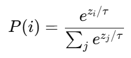

where:

- τ (temperature) is a scaling factor.

- **Low τ (\< 1)** → The distribution becomes **peaked**, favoring the
  highest-probability token (deterministic output).

- **High τ (\> 1)** → The distribution becomes **flatter**, allowing
  more randomness (higher entropy).

**Example**

Assume we have logits for three words:

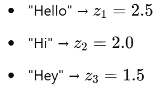

**Without Temperature (τ = 1)**

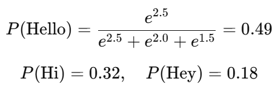

**With Low Temperature (τ = 0.5)**

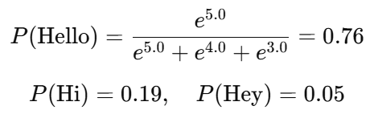

👉 The highest probability word ("Hello") is **much more likely** to be
chosen.

**With High Temperature (τ = 2.0)**

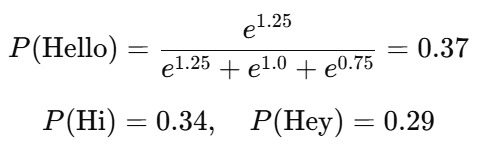

👉 The probabilities are more **evenly distributed**, allowing for
**more diverse outputs**.

**2. Top-K Sampling**

Top-K sampling restricts token choices to the **K most probable tokens**
before applying softmax.

**Mathematical Formulation**

1.  Compute probabilities using softmax:

> 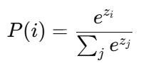 style="width:1.70866in;height:0.79921in" />

2.  **Sort** the probabilities in descending order.

3.  Keep only the top **K** tokens and **redistribute the probability
    mass** among them:

> 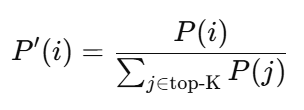 style="width:2.53543in;height:0.91732in" />

**Example**

Assume the model predicts token probabilities:

| **Token**  | **Probability** |
|------------|-----------------|
| "apple"    | 0.40            |
| "banana"   | 0.30            |
| "carrot"   | 0.15            |
| "dog"      | 0.10            |
| "elephant" | 0.05            |

- With **K = 3**, we keep **"apple"**, **"banana"**, and **"carrot"**.

- The new probabilities are **normalized** to sum to 1:

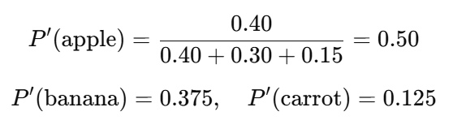

- **"dog"** and **"elephant"** are ignored, even if they had some
  probability.

**3. Top-P (Nucleus) Sampling**

Instead of fixing **K**, Top-P dynamically selects the **smallest set of
tokens whose cumulative probability sums to P** (e.g., 0.9).

**Mathematical Formulation**

1.  Sort all token probabilities P(i)P(i)P(i) in descending order.

2.  Compute **cumulative probability**:

> 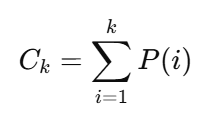 style="width:1.58661in;height:0.85433in" />

3.  Select the smallest kkk such that:

> 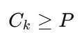 style="width:1.01181in;height:0.47638in" />

4.  **Redistribute the probability mass** among the selected tokens.

**Example**

| **Token**  | **Probability** | **Cumulative Probability** |
|------------|-----------------|----------------------------|
| "apple"    | 0.40            | 0.40                       |
| "banana"   | 0.30            | 0.70                       |
| "carrot"   | 0.15            | 0.85                       |
| "dog"      | 0.10            | 0.95                       |
| "elephant" | 0.05            | 1.00                       |

- If **P = 0.9**, we select **"apple"**, **"banana"**, and **"carrot"**
  (cumulative probability = 0.85).

- If **P = 0.95**, we also include **"dog"**.

**Comparison of Top-K vs. Top-P**

- **Top-K (fixed number of tokens)** can be too rigid: if K=3, it might
  discard an important but slightly lower-ranked token.

- **Top-P (dynamic threshold)** allows more flexibility: if the
  probability distribution is steep (high confidence), fewer tokens are
  needed; if it’s flat (uncertainty), more tokens are included.

**Summary**

| **Method** | **Effect** | **When to Use** |
|----|----|----|
| **Temperature** | Adjusts randomness in probability distribution. | Lower for factual tasks, higher for creativity. |
| **Top-K** | Keeps the top K tokens and renormalizes probabilities. | Use when you want a fixed number of choices. |
| **Top-P** | Selects the smallest set of tokens whose cumulative probability is ≥ P. | More dynamic and adaptive than Top-K. |

# What is the range of Temperature values?

The **temperature (τ)** parameter in LLMs typically ranges from **0 to
∞**, but in practice, it is usually set between **0.1 and 2.0** for
meaningful results.

**Practical Ranges of Temperature**

| **Temperature (τ)** | **Effect on Output** |
|----|----|
| **0.0** | **Greedy**: Always picks the most probable word, making responses **deterministic** and repetitive. |
| **0.1 - 0.3** | **Low randomness**: Responses are more predictable and factual (ideal for Q&A, coding, legal, and medical applications). |
| **0.4 - 0.7** | **Balanced randomness**: A mix of coherence and creativity, useful for storytelling and general-purpose conversation. |
| **0.8 - 1.2** | **High randomness**: More creative, diverse, and sometimes unexpected outputs, used for brainstorming and poetry. |
| **1.5+** | **Very high randomness**: The model generates **chaotic and incoherent** text, losing structure and meaning. |

**Extreme Cases**

- **τ → 0:** The softmax function behaves like an **argmax**, always
  picking the most probable token, making outputs repetitive.

- **τ → ∞:** The distribution becomes **uniform**, meaning all tokens
  have equal probability, leading to completely random outputs.

# Visualization of how temperature affects probability distributions🔥

Here’s a visualization of how **temperature (τ)** affects the
probability distribution of tokens:

- **Low temperature (τ = 0.1, 0.5)**: The distribution is **sharp**,
  meaning the most probable token is heavily favored.

- **Medium temperature (τ = 1.0)**: A balanced distribution where other
  tokens have a chance but the most probable one is still preferred.

- **High temperature (τ = 2.0, 5.0)**: The distribution **flattens**,
  making all tokens more equally likely, leading to more randomness.

This explains why lower temperatures produce **deterministic, factual
responses**, while higher temperatures encourage **creativity and
diversity**. 🚀 ​​

# How LLM selects the final output token if there are multiple tokens remains after applying temperature, top_k and top_p?

After applying **temperature scaling, top-K, and top-P filtering**, the
final token is selected using **random sampling** based on the adjusted
probability distribution. Here’s a step-by-step breakdown of how the
selection happens:

**Step-by-Step Process of Token Selection**

1.  **Raw Logits Computation**  
    The LLM generates raw scores (**logits**) for each possible token.

2.  **Apply Temperature Scaling**  
    The logits are adjusted using the temperature-scaled softmax:

> 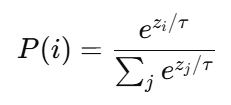 style="width:2.40625in;height:1.09375in" />​

3.  **Apply Top-K Filtering (if enabled)**

    - The top **K** tokens with the highest probability are kept.

    - Other tokens are set to **zero probability**.

    - The remaining probabilities are **renormalized** to sum to 1.

4.  **Apply Top-P Filtering (if enabled)**

    - The **smallest set of tokens** whose cumulative probability
      exceeds **P** is selected.

    - Other tokens are removed, and probabilities are **renormalized**.

5.  **Final Token Selection: Random Sampling**

    - A token is chosen **randomly** from the filtered set, following
      the adjusted probability distribution.

**Example: Token Selection in Action**

**Step 1: Raw Token Probabilities (Before Adjustments)**

| **Token**  | **Logit Score** | **Probability (Softmax)** |
|------------|-----------------|---------------------------|
| "apple"    | 2.5             | 0.40                      |
| "banana"   | 2.0             | 0.30                      |
| "carrot"   | 1.5             | 0.15                      |
| "dog"      | 1.0             | 0.10                      |
| "elephant" | 0.5             | 0.05                      |

**Step 2: Apply Temperature (τ = 0.7)**

After scaling, the probabilities shift slightly to favor more
randomness.

| **Token**  | **Adjusted Probability** |
|------------|--------------------------|
| "apple"    | 0.35                     |
| "banana"   | 0.28                     |
| "carrot"   | 0.18                     |
| "dog"      | 0.12                     |
| "elephant" | 0.07                     |

**Step 3: Apply Top-K (K = 3)**

Only the **top 3** tokens remain.

| **Token** | **Adjusted Probability** |
|-----------|--------------------------|
| "apple"   | 0.42                     |
| "banana"  | 0.34                     |
| "carrot"  | 0.24                     |

**Step 4: Apply Top-P (P = 0.9)**

Since "apple" + "banana" + "carrot" already sum to 0.94, they remain.

**Step 5: Random Sampling**

A random draw (e.g., **weighted roulette wheel**) selects a final token
based on the renormalized probabilities.

- If a random number (e.g., 0.65) falls into **apple's range**, "apple"
  is chosen.

- If it falls into **banana's range**, "banana" is chosen.

- If it falls into **carrot's range**, "carrot" is chosen.

**Key Takeaways**

✅ **Even after filtering, the final token is chosen
probabilistically.**  
✅ **Lower temperatures push the model to select the highest-probability
token.**  
✅ **Higher temperatures allow more diverse tokens to be picked.**  
✅ **Top-K limits the number of choices, while Top-P dynamically selects
based on cumulative probability.**
